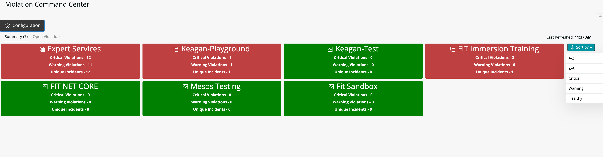
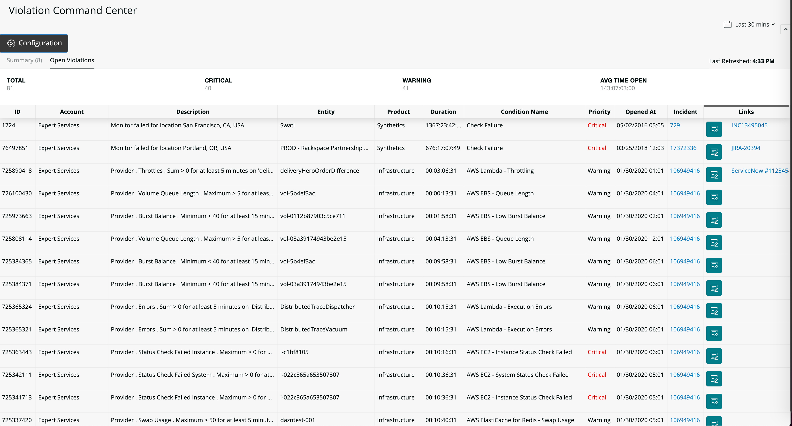
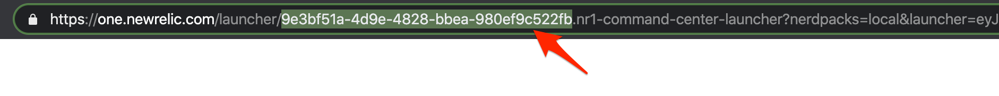

[](https://github.com/newrelic/open-source-office/blob/master/examples/categories/index.md#new-relic-experimental)

# NR1 Violation Command Center

A consolidated violation event view that provides details on opened critical or warning events triggered via New Relic Alerts.

## Usage

Quickly see which accounts have open warning/critical violations or incidents and directly navigate to New Relic Alerts for a given tile.



Drill into a table view of all violations, add notes and links to external sources, and acknowledge incidents directly from the table.



## Open source license

This project is distributed under the [Apache 2 license](LICENSE).

## What do you need to make this work?

* Configured accountId within `alarms.js` (`this.accountId = <your_account_id>`)  **NOTE**: Users will only see persisted data (summary tab, notes/links column) if they are a user within defined account. Please make sure whatever account is specified in `alarms.js` contains all users that will use the application.
* Account Name(s), ID(s), and [REST API Key(s)](https://docs.newrelic.com/docs/apis/get-started/intro-apis/types-new-relic-api-keys#rest-api-key) for desired New Relic account(s) to poll violation events from. This is required during first use, via the **Configuration** button. You can add accounts ad-hoc, or import accounts in bulk following a JSON schema accessed under **Configuration -> Tools**.

```
{
  "accounts": [
    {
      "name": "Account_1", # Account Name
      "value": "39j545kmdksfm3-mk", # REST API Key
      "id": "123456" # Account ID
    },
    {
      "name": "Account_2",
      "value" "dfkm4-2349k459kmf",
      "id": "789123"
    }
  ]
}
```

## Getting started

1. Ensure that you have [Git](https://git-scm.com/book/en/v2/Getting-Started-Installing-Git) and [NPM](https://www.npmjs.com/get-npm) installed. If you're unsure whether you have one or both of them installed, run the following commands. (If you have them installed, these commands return a version number; if not, the commands won't be recognized.)
```bash
git --version
npm -v
```
2. Install the [NR1 CLI](https://one.newrelic.com/launcher/developer-center.launcher) by going to [this link](https://one.newrelic.com/launcher/developer-center.launcher) and following the instructions (5 minutes or less) to install and set up your New Relic development environment.
3. Execute the following commands to clone this repository and run the code locally against your New Relic data:

```bash
nr1 nerdpack:clone -r https://github.com/newrelic-experimental/nr1-command-center.git
cd nr1-command-center
nr1 nerdpack:serve
```

Visit [https://one.newrelic.com/?nerdpacks=local](https://one.newrelic.com/?nerdpacks=local), navigate to the Nerdpack, and :sparkles:

## Deploying this Nerdpack

Open a command prompt in the nerdpack's directory and run the following commands:

```bash
# If you need to create a new uuid for the account to which you're deploying this Nerdpack, use the following
# nr1 nerdpack:uuid -g [--profile=your_profile_name]
# to see a list of APIkeys / profiles available in your development environment, run nr1 credentials:list
nr1 nerdpack:publish [--profile=your_profile_name]
nr1 nerdpack:deploy [-c [DEV|BETA|STABLE]] [--profile=your_profile_name]
nr1 nerdpack:subscribe [-c [DEV|BETA|STABLE]] [--profile=your_profile_name]
```

Visit [https://one.newrelic.com](https://one.newrelic.com), navigate to the Nerdpack, and :sparkles:

## Updating this Nerdpack

1. Copy the current uuid - this can be obtained from the URL of the currently deployed nerdpack:


2. Modify the id field within `nr1.json` with this copied id.

3. Open a command prompt in the nerdpack's directory and run the following commands:
```bash
nr1 nerdpack:publish [--profile=your_profile_name]
nr1 nerdpack:subscribe [-c [DEV|BETA|STABLE]] [--profile=your_profile_name]
```
**NOTE:** Make sure your accountId configured in `alarms.js` matches the profile you are using to publish the new version.
